# Automated Marking System for Algebraic Math Solutions

[](https://www.python.org/)
[](https://react.dev)
[](LICENSE)
[]()

An AI-powered system that automatically grades multi-step handwritten math solutions with step-by-step feedback. Combines OCR, symbolic reasoning, and a fine-tuned LLM to evaluate algebraic problems like a human instructor.

---

## 🏆 Project Recognition

**Best Major Project Award** - IOE Thapathali Campus (2025)

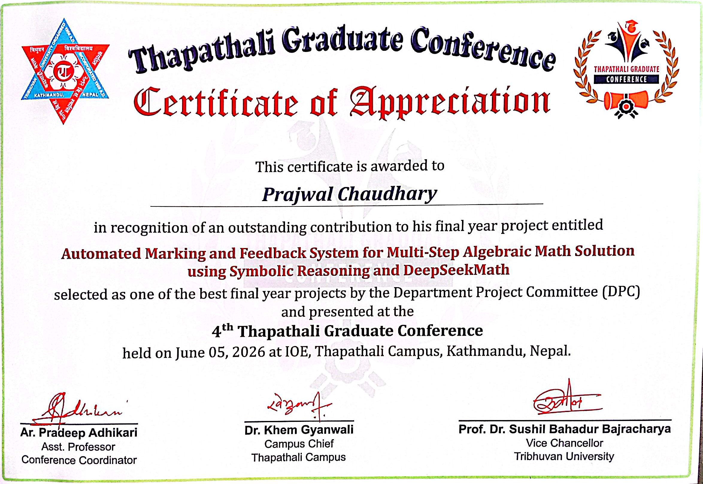  
*<p align="center">Recognized as one of the best major projects among 12 project in BCT batch 078</p>*

---
## 🎯 Project Showcase

### System Interface


<table>
  <tr>
    <td>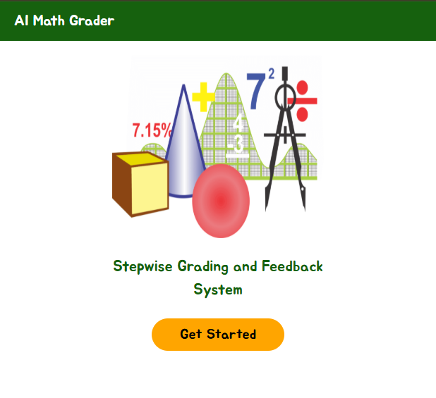</td>
    <td>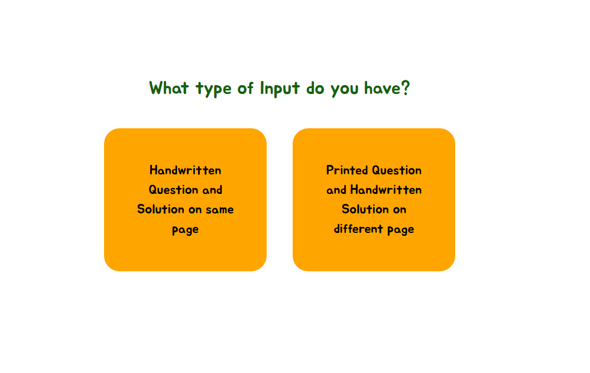</td>
  </tr>
  <tr>
    <td>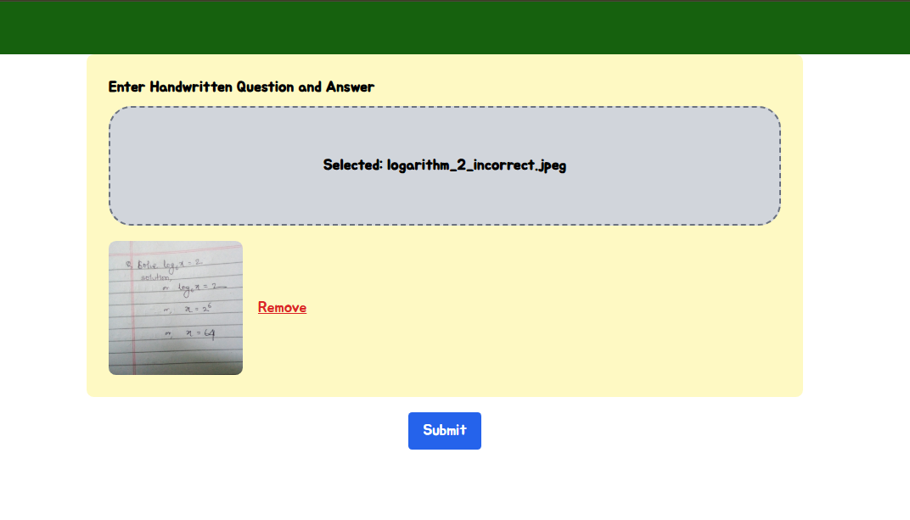</td>
    <td>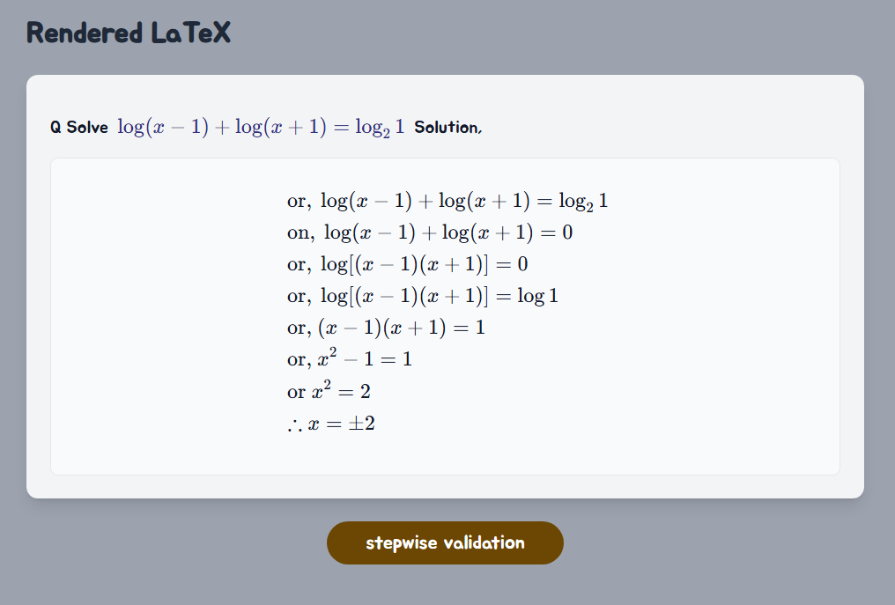</td>
  </tr>
    <td colspan="2"></td>
  </tr>
</table>

### 📹 Demo Video (Optional)

add demo video here 

--- 

## 📋 Table of Contents

- [Project Showcase](#-project-showcase)
- [Project Recognition](#-project-recognition)
- [What It Does](#what-it-does)
- [Key Features](#key-features)
- [Dataset](#dataset)
- [System Architecture](#system-architecture)
- [Tech Stack](#tech-stack)
- [Training](#training)
- [Results Showcase](#results-showcase)
- [Quick Start](#quick-start)
- [Documentation](#documentation)
- [Team](#team)

## What It Does

- 📸 **Reads handwritten math** → Converts to digital format using OCR
- ✓ **Validates each step** → Checks mathematical correctness symbolically
- 🐛 **Detects errors** → Identifies arithmetic mistakes and invalid transformations
- 📊 **Awards partial marks** → Gives credit for correct steps, even if final answer is wrong
- 💬 **Generates feedback** → Explains why answers are right or wrong

## Key Features

✨ Step-by-step validation using symbolic reasoning (SymPy)  
✨ Partial marking algorithm based on solution quality  
✨ Error propagation detection  
✨ Mathematically equivalent answer recognition  
✨ Natural language feedback generation  
✨ Web-based interface for easy image upload  
✨ Supports algebraic simplification, equations, and logarithms  

## Dataset

**Total Samples**: 2,797 question-rubric pairs (after augmentation)

### Distribution by Topic
<p align="center">
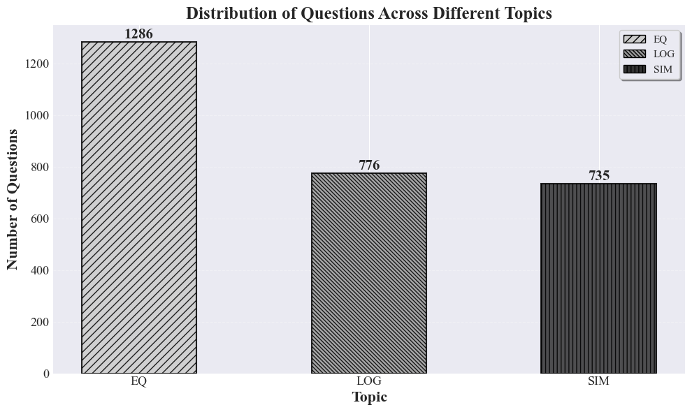
</p>
*Bar chart showing distribution across Simplification, Equations, and Logarithms*

| Topic | Samples | % | Difficulty |
|-------|---------|---|-----------|
| Algebraic Simplification (SIM) | 735 | 26% | Easy, Medium, Hard |
| Algebraic Equations (EQ) | 1286 | 46% | Easy, Medium, Hard |
| Logarithmic Expressions (LOG) | 776 | 28% | Easy, Medium, Hard |

### Distribution by Difficulty Level

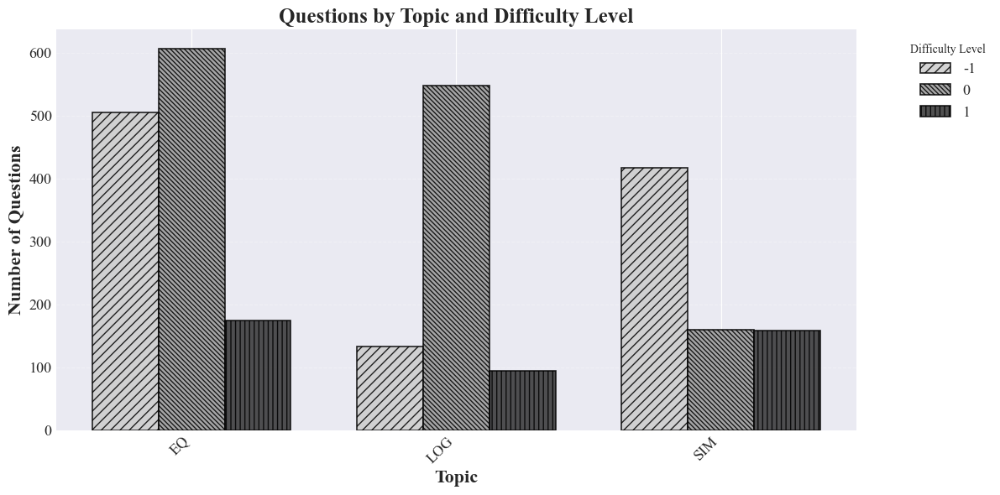  
*Distribution across difficulty levels within each topic*

- **Easy** (1 mark): ~33% of samples
- **Medium** (2 marks): ~33% of samples  
- **Hard** (>2 marks): ~34% of samples

### Data Sources

| Source | Samples | Type |
|--------|---------|------|
| NEB Official Exam Papers | 89 | Real exams (2080-2082) |
| Curriculum Development Center (CDC) | 45 | Official guidelines |
| Class 7-10 Textbooks | 78 | Educational materials |
| Reference Problem Sets | 67 | Competitive math resources |
| **Original Collected** | **219** | **Manually verified** |
| **Augmented via** | | |
| - Variable substitution | +450 | x, y, a, b → different vars |
| - Coefficient scaling | +380 | Numeric manipulation |
| - Structural variations | +340 | Reordered polynomials |
| - Factorization templates | +468 | Standard patterns |
| - Exponent law templates | +340 | Power rules |

**Data Pipeline**: Collection → OCR Extraction → Manual Verification → Cleaning → Augmentation → 2,797 final samples

## System Architecture

### Pipeline Diagram
<p align="center">
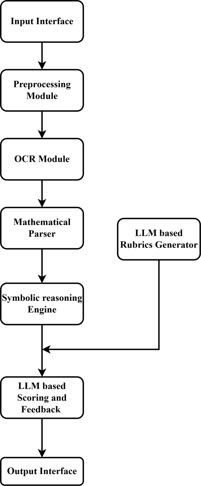
</p>
*Complete system architecture showing data flow from input image to final output*

**What to show here**: 
- Block diagram from your Project Report (Figure 4-1)
- Shows: Image → OCR → Parser → Validation → LLM → Output
- Visual representation of how all components connect

### Component Overview

```
Handwritten Image
      ↓
  [Mathpix OCR] ──→ LaTeX Format
      ↓
  [Regex Preprocessing] ──→ Clean Steps
      ↓
  [SymPy Parser] ──→ Symbolic Objects
      ↓
  [Symbolic Reasoning Engine] ──→ Step Validation
      ↓
  [DeepSeekMath-7B] ──→ Rubric Generation
      ↓
  [LLM Marking Engine] ──→ Score + Feedback
```

**Key Components:**
- **Symbolic Engine**: Ensures mathematical correctness
- **LLM**: Generates human-like explanations & rubrics
- **Partial Marking**: Rewards partial progress algorithmically

## Tech Stack

| Layer | Technology |
|-------|-----------|
| **Backend** | Python, Flask, SymPy, DeepSeekMath-7B |
| **Frontend** | React, Tailwind CSS |
| **ML/AI** | PyTorch, Hugging Face, LoRA fine-tuning |
| **OCR** | Mathpix API |
| **Infrastructure** | Google Colab|

## Training

### Model Training Curves

**Training Configuration**:
- Model: DeepSeekMath-7B with LoRA (rank 32)
- Dataset: 2,237 training samples (80%)
- Epochs: 5 with early stopping
- Optimizer: AdamW (lr=0.0005)
- Batch Size: 32

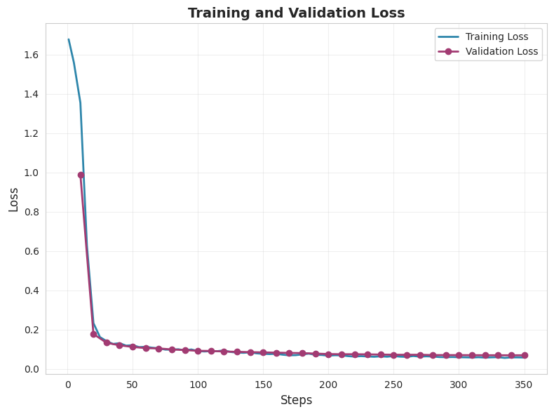  
*Training and validation loss convergence over 5 epochs*

### Performance Metrics

| Metric | Score | Details |
|--------|-------|---------|
| **OCR Accuracy** | 95% | Character error rate on clear handwriting |
| **Symbolic Validation** | 100% | Step-by-step mathematical correctness |
| **Partial Marking Accuracy** | 90% | Alignment with human rubrics |
| **Parse Success Rate** | 98% | Valid JSON output generation |
| **Model Convergence** | ✓ | Stable training with minimal overfitting |

## Results Showcase

These are **actual output examples** from the system when grading different solutions:

### Example 1: Perfect Solution ✅

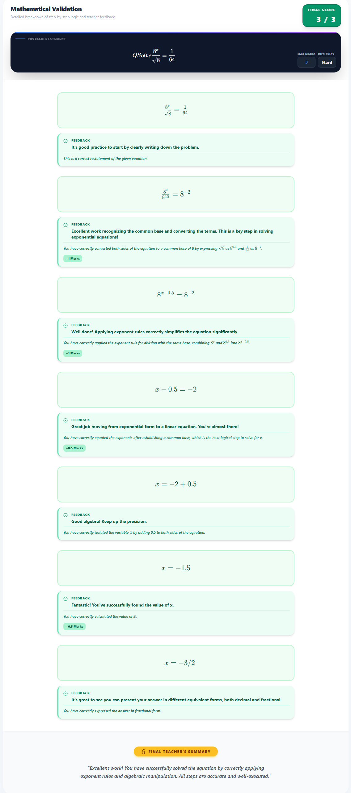  
*Perfect solution (3/3 marks) - All steps correct, full feedback provided*

**What's shown**: Input math image → Output: Full marks, positive feedback, congratulatory message

---

### Example 2: Partial Credit ⚠️

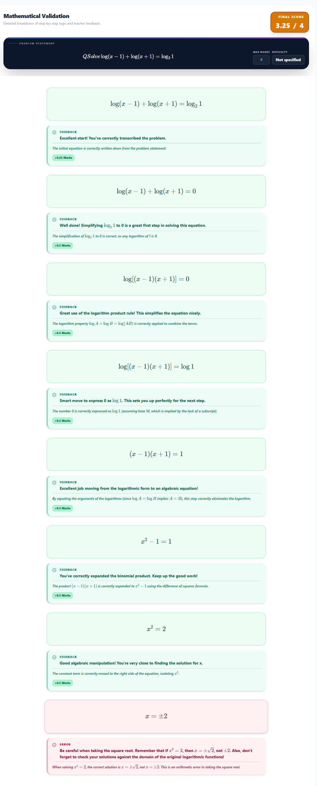  
*Partial credit (3.25/4 marks) - Some steps correct, some wrong, detailed error analysis*

**What's shown**: Input math image → Output: Partial marks, error highlighting, which step went wrong

---

### Example 3: Error Detection ❌

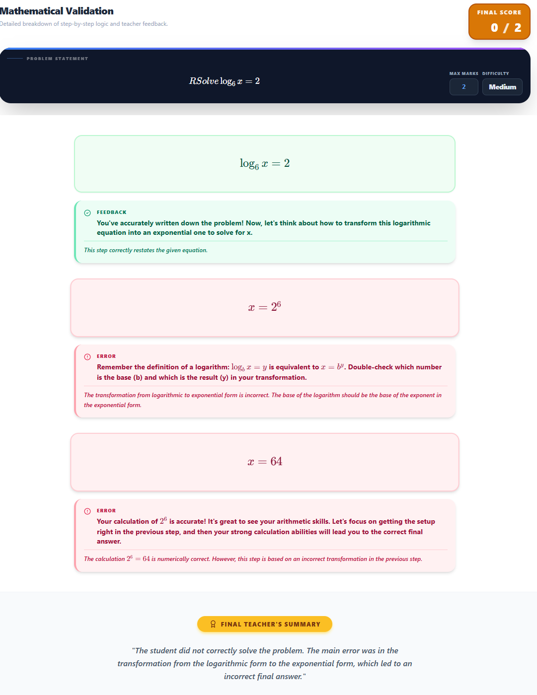  
*Error detection (0/2 marks) - Critical error caught, learning feedback provided*

**What's shown**: Input math image → Output: zero marks, explanation of where calculation failed, suggestions

---

**Key Achievements**:
- ✅ Detects arithmetic errors in intermediate steps
- ✅ Recognizes mathematically equivalent forms
- ✅ Provides step-specific feedback and error propagation analysis
- ✅ Maintains consistency in grading

## Quick Start

### Prerequisites
- Python 3.8+
- Node.js 14+
- Mathpix API key ([get one here](https://mathpix.com/))

### Installation

```bash
# Clone repository
git clone https://github.com/yourusername/math-autograder.git
cd math-autograder

# Backend setup
python -m venv venv
source venv/bin/activate  # Windows: venv\Scripts\activate
pip install -r requirements.txt

# Set environment variables
cp .env.example .env
# Edit .env with your Mathpix credentials

# Run backend
flask --app run run

# In another terminal: Frontend setup
cd frontend
npm install
npm start
```

Open `http://localhost:3000` → Upload image → Get instant marks + feedback

## Documentation

📄 **Full Technical Details**: See [Project_Report.pdf](Project_Report.pdf)
- Complete methodology & algorithm details
- Dataset construction (2,797 NEB exam samples)
- Model fine-tuning process (LoRA)
- Comprehensive evaluation metrics
- Implementation code snippets
- Detailed results analysis
- Future improvements roadmap

## Team

| Name | Roll | 
|------|------|
| **Prajwal Chaudary** | THA078BCT028 |
| Jesis Upadhayaya | THA078BCT017 | 
| Purushottam Gajurel | THA078BCT032 | 
| Sagar Bikram Adhikari | THA078BCT037 | 

**Supervisor**: Asst. Prof. Suwarna Lingden  
**Institution**: Institute of Engineering, Tribhuvan University (2025)

## License

MIT License - see [LICENSE](LICENSE) file


⭐ If this project helped you, please star it on GitHub!